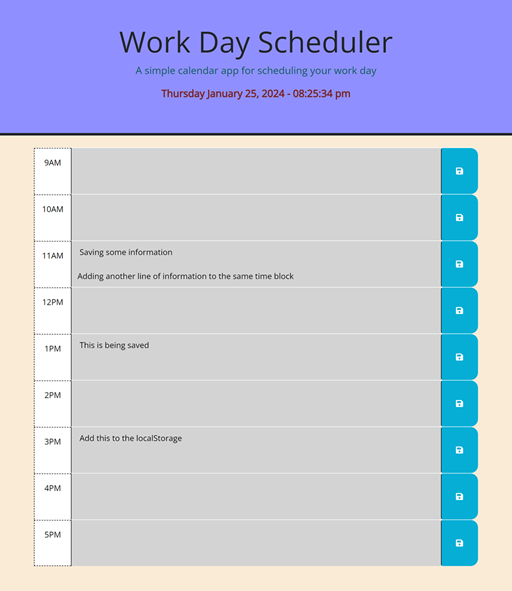
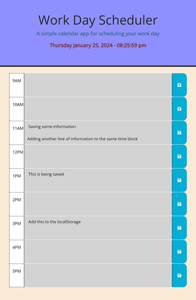
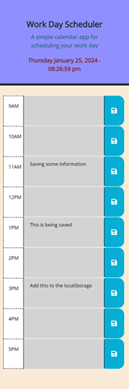

# Work Day Scheduler

## Overview
I created this work day scheduler as a way for a user to save past, present, and future tasks between the hours of 9am-5pm as a quick and easy way for the user to reference what tasks they should have already completed, be currently working on, or working on later in their work day.

## Features

1. Responsive Design

I designed my webpage to be fully responsive from the smallest mobile devices, to tablets, to the largest desktops to provide a consistent means to view my work day scheduler in an enjoyable and engaging experience.

2. Current Date & Time

At the top left of the page, you will see the current date and time dynamically updated every second to provide the user a quick and easy way to view the current date and time in relation to their daily task list (work day scheduler).

3. Color Coded Time Blocks

In the body of the webpage, you will see times ranging from 9am-5pm. These times will be color coded based on whether that time block is in the past, present, or future. A past time block will appear grey, a present time block will appear red, and a future time block will appear green.

4. Saving tasks to localStorage

Each time you enter a task into its respective time block and click on the save button located to the right of each time block, it will store your entered information to localStorage so you can view your saved tasks at a future time when refreshing or navigating back to the webpage.

5. Technologies Used

* HTML5
* CSS
* JavaScript
* Day.js
* Bootstrap
* jQuery
* VSCode
* GitBash

## Usage
To view this webpage, please visit https://joshmassa.github.io/work-day-scheduler/

To view this projects repository, please visit https://github.com/JoshMassa/work-day-scheduler

When viewed from a desktop, the webpage should resemble the following image:

When viewed from a tablet, the webpage should resemble the following image:

When viewed from a mobile device, the webpage should resemble the following image:

## Credits
This project brought to you in part by UCLA Extension and its staff including but not limited to: Our class instructor and teaching assistant of UCLA Extension Coding Bootcamp 2023-2024.

Links to resource references used as follows:

https://day.js.org/docs/en/display/format

https://getbootstrap.com/docs/5.3/getting-started/introduction/

https://jquery.com/

## License
This project does not contain a license.